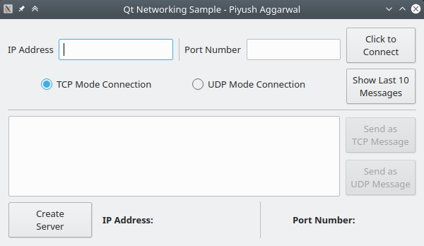
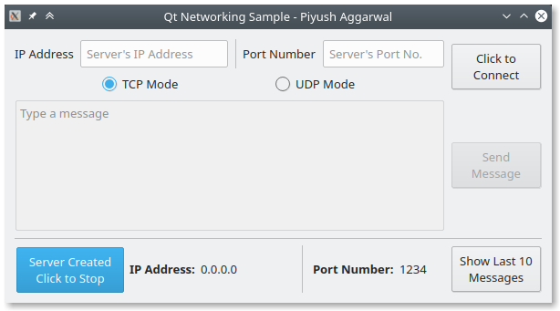
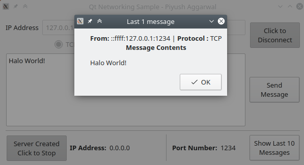
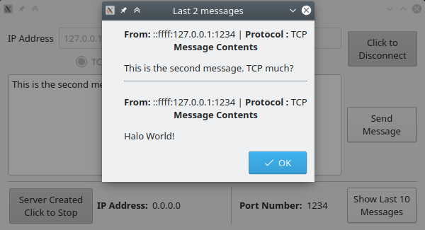
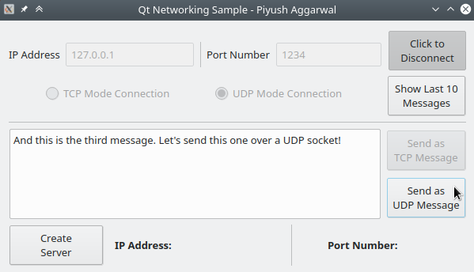
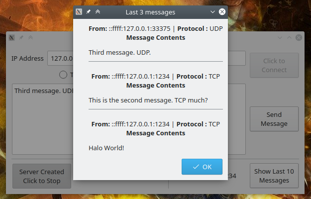
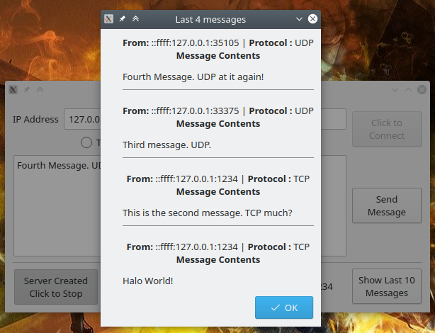

# Networking with Qt

Basic network communication example with QTcpSocket, QUdpSocket, and QTcpServer.

A Qt project that supports listening to messages over socket. 

## Features

- The IP Address and Port Number are runtime input from the user. Send messages to any IP-port combination.
    - The message to send is an input from a `textEdit` box.
- Supports both TCP and UDP communications.

- Also contains functionality to create a Server.
    - Listens to both UDP messages as well as TCP message simultaneously. (priority to TCP - keeps reading while `bytesAvailable`)
    - You can view the last 10 messages sent to the server in a `QMessageBox`.

- UI/UX is bae.

- WYSIWYG - check out the Gallery to see what it does. 

## How To Run
- Open the `.pro` file from within Qt Creator
- Run the project
- Disable the last line within the `.pro` file to get qDebug() statements in a separate console window.

## TODO
- The UDP connection happens over a single QUdpSocket right now. Need to look into improving the implementation with two sockets instead of just one.

## Gallery (to be updated)

