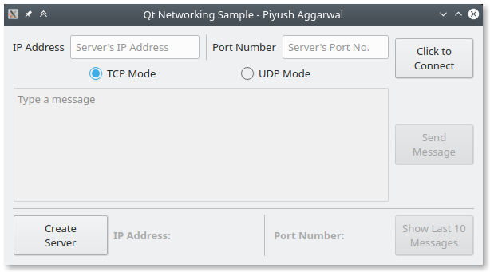

# Networking with Qt

Basic network communication example with QTcpSocket, QUdpSocket, and QTcpServer.

## Features
- dekhte hain

## How To Run
- Open the `.pro` file from within Qt Creator
- Run the project
- Disable the last line within the `.pro` file to get qDebug() statements in a separate console window.

## TODO
- look for [TODO] in code comments.

## Gallery

