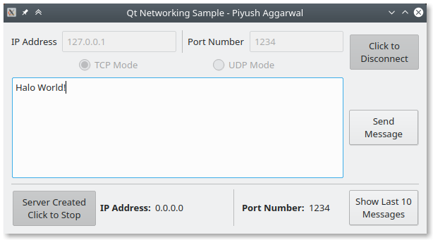
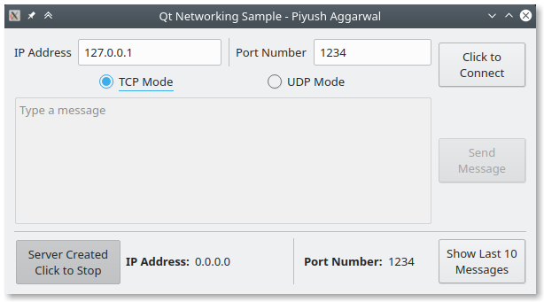

# Networking with Qt

Basic network communication example with QTcpSocket, QUdpSocket, and QTcpServer.

A Qt project that supports listening to messages over socket. 

## Features

- The IP Address and Port Number are runtime input from the user.
- You can view the last 10 messages in a QMessageBox.
- Supports both TCP and UDP socket which are selectable by the user from the GUI itself.
- Also contains functionality to create a server.
    - The message to send is an input from a textEdit box.

- UI/UX is bae.
- WYSIWYG - check out the Gallery to see what it does. 

## How To Run
- Open the `.pro` file from within Qt Creator
- Run the project
- Disable the last line within the `.pro` file to get qDebug() statements in a separate console window.

## TODO
- The UDP connection happens over a single QUdpSocket right now. Need to look into improving the implementation with two sockets instead of just one.

## Gallery

